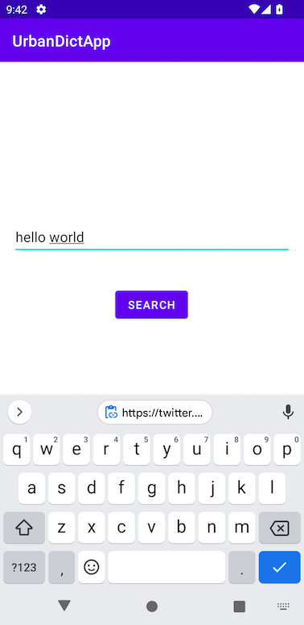
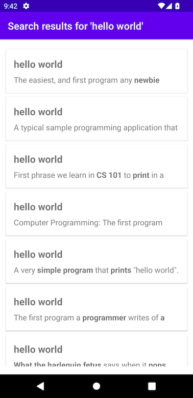
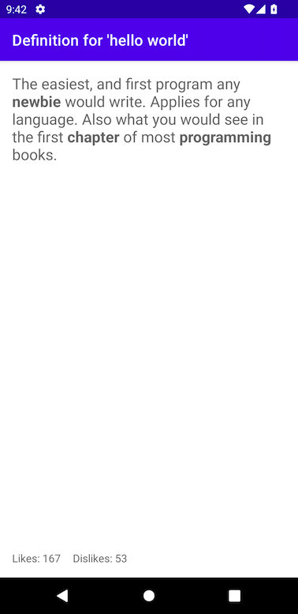

# Urban Dictionary Searcher

## About
This is a simple Android app (using Android SDK Level 31/Android S) that lets the user search for a term on [Urban Dictionary](https://rapidapi.com/community/api/urban-dictionary) and displays fetched details of matched terms.

The app was instructed by [Kilo Loco](https://twitter.com/kilo_loco) from this [YouTube tutorial](https://www.youtube.com/watch?v=gDEGd174K_Q).

## How to Run
1. Clone the repo to your local machine
2. Open the project with Android Studio
3. Build and run the app on an Android emulator that's Lollipop 5.0+

## Screenshots

